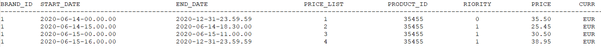

<h1 align="center"> Spring Boot Products - Hexagonal Architecture </h1>

  

   

[Descripción del proyecto](#descripción-del-proyecto)

## Descripción del proyecto
Servicio en SpringBoot que provee una end point rest de consulta.

Acepta como parámetros de entrada: fecha de aplicación, identificador de producto, identificador de cadena.

Devuelve como datos de salida: identificador de producto, identificador de cadena, tarifa a aplicar, fechas de aplicación y precio final a aplicar.

Utiliza una base de datos en memoria (tipo h2) que se inicializa con los datos:

