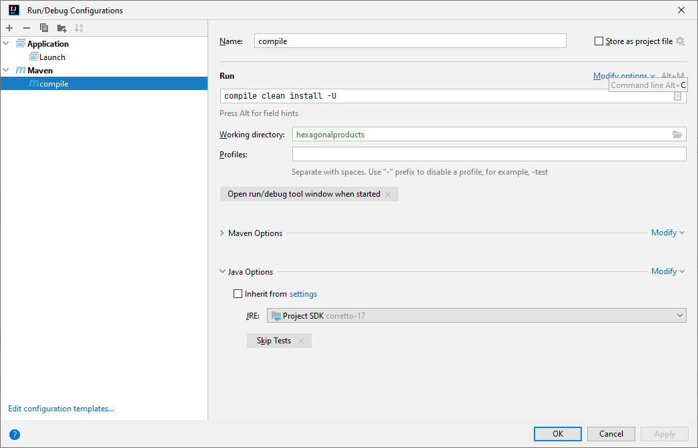
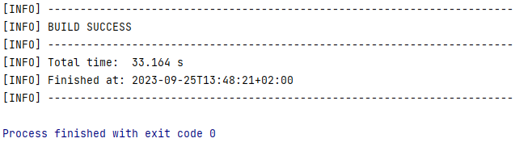
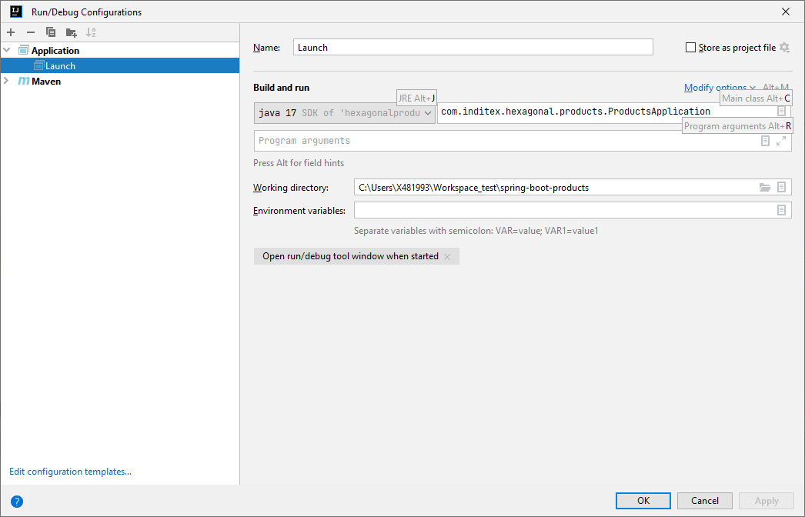
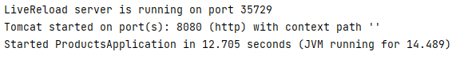

<h1 align="center"> Spring Boot Products - Hexagonal Architecture </h1>

  

   

[Descripción del proyecto](#descripción-del-proyecto)

[Tecnologías utilizadas](#tecnologías-utilizadas)

[Estructura del proyecto](#estructura-del-proyecto)

[Ejecución](#ejecución-del-proyecto)

## Descripción del proyecto
Servicio en SpringBoot que provee una end point rest de consulta.

Acepta como parámetros de entrada: fecha de aplicación, identificador de producto, identificador de cadena.

Devuelve como datos de salida: identificador de producto, identificador de cadena, tarifa a aplicar, fechas de aplicación y precio final a aplicar.

Utiliza una base de datos en memoria (tipo h2) que se inicializa con los datos:

## Tecnologías utilizadas

  
  
  
  
  

## Estructura del proyecto

Se ha creado una estructura hexagonal, la cual nos ayudará a seguir los principios SOLID, y nos permitirá una buena escalabilidad y mantenibilidad.
La entrada a nuestro servicio está en la capa de infraestructura, la cual se comunica con el modelo a través de la capa de aplicación, y viceversa.

## Ejecución del proyecto

<h3>Se deberá crear una configuración Maven para limpiar y compilar el proyecto:</h3>

<h3>Seguidamente se ejecutará una nueva configuración de tipo Application:</h3>

<h3>Una vez la aplicación esté levantada, se podrá ejecutar la llamada</h3>
curl --location 'http://localhost:8080/v1/products' \
--header 'Content-Type: application/json' \
--data '{
"applicationDate": "2020-06-16 21:00:00",
"productId": "35455",
"brandId": "1"
}'